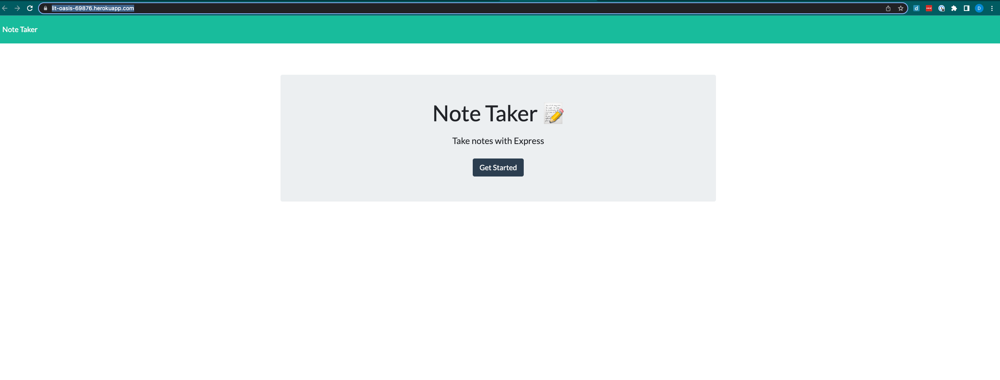
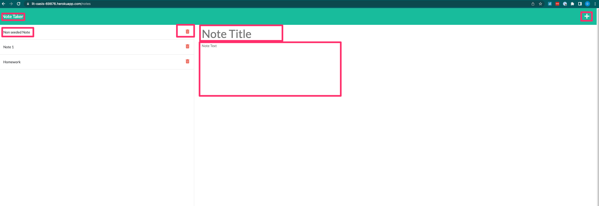
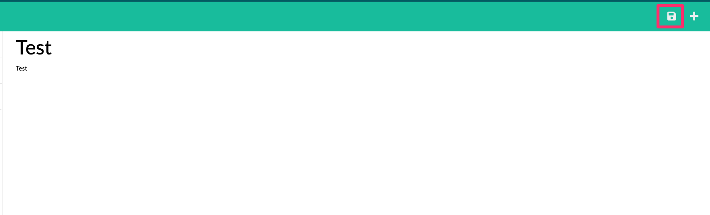

# Best Personal Note Taker

## Overview
The "Best Personal Note Taker" application was built to give users an opportunity to interact with a web interface that allows users to create personal notes, view existing notes, and delete existing notes. 

When you launch this application, you will be taken to a webpage that allows you to add personal notes, view existing notes, and delete existing notes. On the back-end, we have built some API routes that handle the reading, creating, and deleting of personal notes. We use these routes, alongside the "fs" npm package to read, update, and remove data from a local db.json file. As data is updated, the webpage that the user interacts with should also be updated. 

The overall goal of this project is to get a feel for the basics of working with API routes, reading and updating local files, as well as being able to deploy an application to a webservice such as Heroku. 

## Table of Contents
- [Overview](#overview)
- [Installation](#installation)
- [Usage](#usage)
- [License](#license)
- [Contributors](#contributors)
- [Questions](#questions)

## Installation

While we have built this application to run through Heroku, you can definitely run this application locally. To be able to run this application locally, you will need to make sure that you have the following packages installed: 

- Express
- FS

You should also be able to install these packages by running the following command: 
- `npm i -y`

Once you have installed the appropriate packages, you can run the app by running the following command: 

- `npm start` ==> This will run `node server.js`

If this is your first time running the application, we also recommend that you run the following command: 

- `npm run seed` ==> This will run `node ./db/helpers/notes.js`

Running this command should allow seed the local database file with some starter data that you can interact with. 

## Usage

If you'd like to access the application through our Heroku instance, please navigate to the following:  
`https://lit-oasis-69876.herokuapp.com/`

When you navigate to this page you should be presented with the option to "Get Started" clicking on this button will take you to the "Notes" page where you will see a list of existing notes and be presented with options to add a note, read an existing note, or delete an existing note. 

  

On the main homepage, you will need to click on the "Get Started" button to initialize the application. When you click on this button you will get redirected to the "notes" page. 

  

On the main notes page, you will be given a few options to interact with: 

- Clicking on the `Note Take` button will take you back to the homepage.
- On the middle of the screen, you will be presented with the option of adding a new note title and a note text. This is where you will enter your data. Once you have field i the title and text, a save button will appear, this will give you the option to save your note. 

  

- If you want to scrap the note that you are currently working on, you can click on the "+" button to start a new note. 
- On the left hand side of the page, we will also render a list of the notes that are currently in the database. Clicking on the name of the note, will display it on the modal to the right.
- Clicking on the trash can next to the note title, will delete an existing note. 

#### API Usage

We built a simple backend API that allows us to read, create, and delete existing notes based on user input from the webpage. IF you would like to read more about the API functionality, please click on the link below to visit the API wiki. 

https://github.com/dcast0607/Best-Personal-Note-Taker/wiki/Best-Personal-Note-Taker-API-Documentation

## Demo

- Full Demo Walkthrough: https://www.loom.com/share/b38dd56b4f5649948415350d2886b19f

## License

 
 
 

## Contributors

**Author:**
Daniel Castro  
**Github Link:**
https://github.com/dcast0607
**Repository Link:**
https://github.com/dcast0607/Best-Personal-Note-Taker

## Questions

If you have any questions or concerns, please contact me via email.